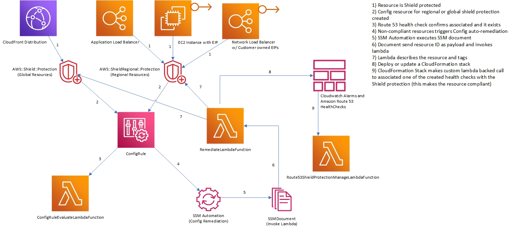

## Overview
Custom config rules to establish Proactive Engagement Route 53 health checks with default best practices, consumes resource tags to customize health checks

_____

## CloudFormation Details
__Run in__: `AWS Organizational MGMT/Administrator Account`
__Mechanism__: `CloudFormation StackSet`  
__Template__: `route53/config-proactive-engagement/cfn/config-proactive-engagement.yaml`  
__Deploy to__: `All accounts, use ORG`  
__Region(s)__: `us-east-1(mandatory), <all other regions> (if resources exist in multiple regions) Deployment method should be sequential with us-east-1 as the first region in the list followed by all other regions for regions.`

____
## How it works

## CODE
remediate folder contains the lambda that gets invoked on config rule evaluation call. This method identifies all the resources that are tagged non compliant by shield and the health check stack creation requests for these resources are submitted to SQS queue.

cfn-stack-manage contains the lambda that gets invoked on a event schedule at every 10minutes (configurable from cfn). The lambda polls the sqs queue and reads 5 messages (configurable from cfn) on every invocation. This lambda creates the HealthCheck stacks for non compliant resource remediation.

Commented out the logic to invoke config rule re-evaluation, since the evaluation is invoked once a day via _______. This commented function has the logic to identify the custom config rule and check if it is compliant or non compliant and call the rule re-evaluation if it is still non compliant. Reason for adding this: we have seen a behavior that some resources were not evaluated automatically for a long period. They needed to be re-evaluated.

#### Native CloudFormation
IAM Roles, SSM Automation Document, Custom Config rule, Lambda functions

#### Custom Config Rule

ShieldProtectionRegional and ShieldProtection Config resources are evaluated to ensure an existing Amazon Route 53 health check is associated with the Shield protection. Config does NOT confirm the configuration of an existing Route 53 health check. CheckTags can be specified to scope based on target resource tags for in scope resources if desired. When a resource is in scope and not compliant, an automatic remediation (SSM automation document) invokes Lambda to review for specific tags to customize Proactive Engagement Health Checks and then creates or updates a CloudFormation stack. This CloudFormation stack creates CloudWatch alarms and health checks (defaults based on resource type) and makes a custom lambda backed call which associates the calculated route 53 health check with the Shield protection.



#### StackSet Requirement
When creating a stack set to deploy this mechanism, you must deploy to the us-east-1 region first (specify it first in the list of regions in scope) and deploy sequentially, not in parallel
_____

## Dependencies
* [Service Managed Stack Sets](../../prerequisites.md)  
* [Route53 Associate Shield Protection](../route53/route53-associate-shield-protection/readme.md)  
_____

## Parameter details:

#### CodeS3BucketPrefix
Modules use this consistent value to calculate the S3 bucket where relevant code is in place.  This includes lambda zip objects and other cfn templates for reference.  When consumed, the local region will be added as a suffix to this value.

__Required:__: Yes  
__Type__: String  
__AllowedPattern__: See [Bucket naming rules](https://docs.aws.amazon.com/AmazonS3/latest/userguide/bucketnamingrules.html).  Note, the full bucket name will include the local region, ensure this value plus the longest region you intent to use is less than the maximum length for a bucket name allowed.


#### CodeS3Key
S3 Key path to zip file.  By default, this should be the same for all parameters with this name

__Required__: Yes  
__Type__: String  
__Default__: lambda.zip  

#### Remediation
S3 Key path to zip file.  By default, this should be the same for all parameters with this name

__Required__: No  
__Type__: String  
__Default__: True  
__AllowedValues__:  
  * True  
  * False  

#### ALBHealthCheckKey
Default CloudFormation template for auto-remediation of ALB resources.

__Required__: No  
__Type__: String  
__Default__: code/route53/healthChecks/alb-health-check.yaml

#### CloudfrontHealthCheckKey
Default CloudFormation template for auto-remediation of CloudFront resources

__Required__: No  
__Type__: String  
__Default__: code/route53/healthChecks/cf-health-check.yaml


#### EIPEC2HealthCheckKey
Default CloudFormation template for auto-remediation of EIPs associated with EC2 resources.

__Required__: No  
__Type__: String  
__Default__: code/route53/healthChecks/eip-health-check.yaml


#### NLBHealthCheckKey
Default CloudFormation template for auto-remediation of CloudFront resources.

__Required__: No  
__Type__: String  
__Default__: code/route53/healthChecks/nlb-health-check.yaml

#### CloudFrontForceEnableEnhancedMetrics
If CloudFront should have additional metrics enabled.  This must be in place for CloudFront distributions to use default (recommended metrics)

__Required__: No  
__Type__: String  
__Default__: Yes  
__AllowedValues__:
  * Yes
  * No

#### HealthCheckRegions
"Comma separated list of regions to complete Route 53 health checks from.  See [Route 53 supported regions](https://docs.aws.amazon.com/Route53/latest/APIReference/API_HealthCheckConfig.html#Route53-Type-HealthCheckConfig-Regions) for a list of valid options.  Note, this must include at least three regions

__Required__: No  
__Type__: String  
__Default__: us-east-1,us-west-2,eu-west-1

#### CheckTags
JSON list of tag and/or tag/values to scope resources.

__Required__: No  
__Type__: String  
__Default__: []
__AllowedValues__: See [CheckTags](/references/checktag.md)

#### snsTopicDetails

When snsCalcuation is CentralAccount:
> The accountID and SNS topic name in the format <AccountId>|<SnsTopicName>.  e.g. 111111111111|mySnsTopic.  This is used to calculate the regional ARN for SNS topics.

When snsCalcuation is LocalAccount
> The SNS topic name only, e.g. ddos-alerts.  This is used to calculate the local and regional SNS topic with that name (note, the topic is NOT created here, you need to create it yourself)
__Required__: Yes  
__Type__: String
_____

#### snsCalculation

__Required__: Yes  
__Type__: String \
__AllowedValues__: LocalAccount, CentralAccount
_____


## Deployment scripts
### Create stack Set

```
aws cloudformation create-stack-set \
--stack-set-name config-proactive-engagement \
--template-body file://code/route53/config-proactive-engagement/cfn/config-proactive-engagement.yaml \
--capabilities CAPABILITY_AUTO_EXPAND CAPABILITY_NAMED_IAM CAPABILITY_IAM \
--permission-model SERVICE_MANAGED \
--auto-deployment Enabled=true,RetainStacksOnAccountRemoval=false \
--parameters \
ParameterKey=CodeS3BucketPrefix,ParameterValue=$BucketPrefix-$PayerAccountId \
ParameterKey=CodeS3Key,ParameterValue=lambda.zip 
```

### Add stacks to stack set
```
aws cloudformation create-stack-instances \
--stack-set-name config-proactive-engagement \
--regions $Regions \
--deployment-targets OrganizationalUnitIds=$ParentRoot \
--operation-preferences RegionConcurrencyType=SEQUENTIAL,MaxConcurrentPercentage=100 
```
